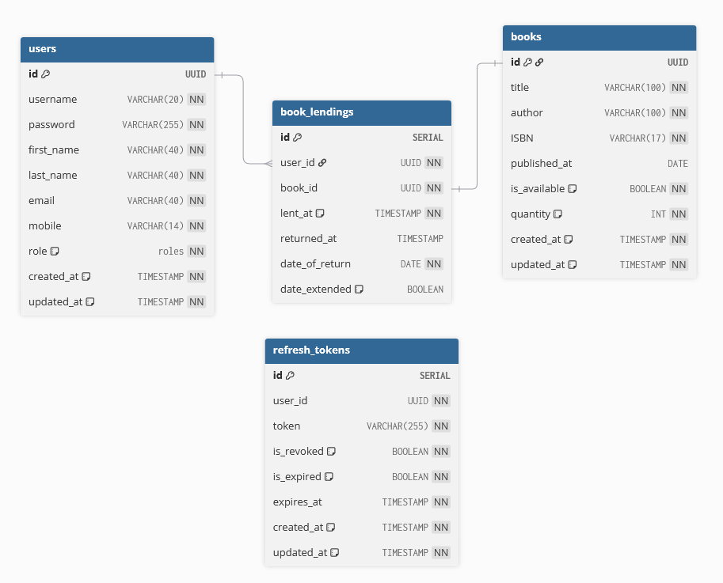

# Library API

## Table of contents

- [About the project](#about-the-project)
- [Installation and usage](#installation-and-usage)
    - [Requirements](#requirements)
    - [How to initialize the database](#how-to-initialize-the-database)
    - [Configuration](#configuration)
    - [How to run the project in development mode](#how-to-run-the-project-in-development-mode)
    - [How to build and run the project in production mode](#how-to-build-and-run-the-project-in-production-mode)
- [Database schema](#database-schema)

## About the project

This API is made as a personal project in order to better understand **Fastify**, **NodeJS**, **Typescript** and *
*PostgreSQL**. With this API, the client will be able to manage books, rentals and the users of the library. For the
authentication, it uses **JSON web tokens**. For the validation of the input **JSON-Schema** is being used. Moreover,
**Luxon** is used for date-time formatting. While it tries to be a simple project, the goal is to make it as secure as
possible, use design patterns wherever possible and trying to follow best practices.

## Installation and usage

### Requirements

1. ```NodeJS >= 22.11.0```
2. ```PostgreSQL``` for the database

### How to initialize the database

First, you need to initialize the database. For that, you need the **init-db.sql** file located inside the **database**
directory. You can run this file in Dbeaver or in an another program of your liking. Once the database is initialized,
please follow the below instructions on how to run the project.

### Configuration

Before you are able to run the project, a **.env** file should be created inside the root directory, containing the
following options:

```
# App settings
HOST=
PORT=

# JWT settings
ACCESS_TOKEN_SECRET=
REFRESH_TOKEN_SECRET=

# Database settings
DB={"host":"","port":5432,"database":"","user":"","password":""}
```

### How to run the project in development mode

In order to run your app in development mode, you need to run the following commands in your terminal:

1. ```npm install```
2. ```npm run dev```

### How to build and run the project in production mode

In order to run your app in production mode, you need to run the following commands in your terminal:

1. ```npm install``` if you haven't already run it
2. ```npm run build``` in order to compile the typescript code and generate the required **.js** files
3. ```npm start``` to start the app

The generated files after you run ```npm run build``` are located inside the **dist** directory.

## Database schema
The database schema is created using **[dbdiagram](https://dbdiagram.io/home)**.
Documentation for dbdiagram can be found **[here](https://dbml.dbdiagram.io/docs)**.

### DBDiagram code
```text
// Use DBML to define your database structure
// Docs: https://dbml.dbdiagram.io/docs

Table users {
    id         UUID         [PRIMARY KEY]
    username   VARCHAR(20)  [UNIQUE, NOT NULL]
    password   VARCHAR(255) [NOT NULL]
    first_name VARCHAR(40)  [NOT NULL]
    last_name  VARCHAR(40)  [NOT NULL]
    email      VARCHAR(40)  [UNIQUE, NOT NULL]
    mobile     VARCHAR(14)  [UNIQUE, NOT NULL]
    role       roles        [NOT NULL, DEFAULT: 'user']
    created_at TIMESTAMP    [NOT NULL, DEFAULT: 'CURRENT_TIMESTAMP']
    updated_at TIMESTAMP    [NOT NULL, DEFAULT: 'CURRENT_TIMESTAMP']
}

Table books {
  id UUID [PRIMARY KEY]
  title        VARCHAR(100) [NOT NULL]
  author       VARCHAR(100) [NOT NULL]
  ISBN         VARCHAR(17)  [NOT NULL, UNIQUE]
  published_at DATE
  is_available BOOLEAN      [NOT NULL, DEFAULT: FALSE]
  quantity     INT          [NOT NULL, DEFAULT: 0]
  created_at   TIMESTAMP    [NOT NULL, DEFAULT: 'CURRENT_TIMESTAMP']
  updated_at   TIMESTAMP    [NOT NULL, DEFAULT: 'CURRENT_TIMESTAMP']
}

Table book_lendings {
  id             SERIAL    [PRIMARY KEY]
  user_id        UUID      [NOT NULL]
  book_id        UUID      [NOT NULL]
  lent_at        TIMESTAMP [NOT NULL, DEFAULT: 'CURRENT_TIMESTAMP']
  returned_at    TIMESTAMP
  date_of_return DATE      [NOT NULL]
  date_extended  BOOLEAN   [DEFAULT: FALSE]
}

Table refresh_tokens {
  id         SERIAL [PRIMARY KEY]
  user_id    UUID         [NOT NULL]
  token      VARCHAR(255) [NOT NULL]
  is_revoked BOOLEAN      [NOT NULL, DEFAULT: FALSE]
  is_expired BOOLEAN      [NOT NULL, DEFAULT: FALSE]
  expires_at TIMESTAMP    [NOT NULL]
  created_at TIMESTAMP    [NOT NULL, DEFAULT: 'CURRENT_TIMESTAMP']
  updated_at TIMESTAMP    [NOT NULL, DEFAULT: 'CURRENT_TIMESTAMP']
}

Ref: book_lendings.user_id > users.id
Ref: book_lendings.book_id - books.id
```

### ER Diagram
Below, you can find the ER diagram for the database.
